# SEMANA No 1 — DOSW Manejo de Streams

## Datos personales:
- Nombre y Apellido: Cristian Santiago Moreno
- Código de Estudiante: 1000100162
- Curso: DOSW

### Ejercicio 01 — Números Pares mayores a diez

Dada una lista de números enteros, obtener una nueva lista solo con los números pares mayores a 10.

**Código implementado:**
```java
package dosw.semana_1.streams;

import java.util.List;
import java.util.stream.Collectors;

public class Ejercicio1 {

    public static void main(String[] args) {
        List<Integer> numeros = List.of(3, 8, 10, 12, 15, 18, 20);

        List<Integer> resultado = numeros.stream()
                .filter(n -> n % 2 == 0 && n > 10)
                .collect(Collectors.toList());

        System.out.println(resultado);
    }
}
```

**Captura de ejecución:** 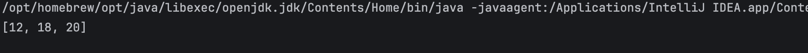

**Explicación:** Se usó `filter()` con una expresión lambda para evaluar dos condiciones (número par y mayor a 10) sobre el Stream de la lista original, obteniendo así únicamente los elementos que cumplen ambas.

### Ejercicio 02 — Cantidad de Palabras con más de 4 caracteres

Dada una lista de palabras: filtrar las que tengan más de 4 caracteres, convertirlas a mayúsculas, ordenarlas alfabéticamente y obtener la cantidad total.
**Código implementado:**
```java
package dosw.semana_1.streams;

import java.util.List;
import java.util.stream.Collectors;

public class Ejercicio2 {

    public static void main(String[] args) {
        List<String> palabras = List.of("java", "stream", "api", "functional", "code", "git");

        List<String> resultado = palabras.stream()
                .filter(p -> p.length() > 4)
                .map(String::toUpperCase)
                .sorted()
                .collect(Collectors.toList());

        System.out.println("Cantidad de palabras resultantes: " + resultado.size());
    }
}
```


**Captura de ejecución:** 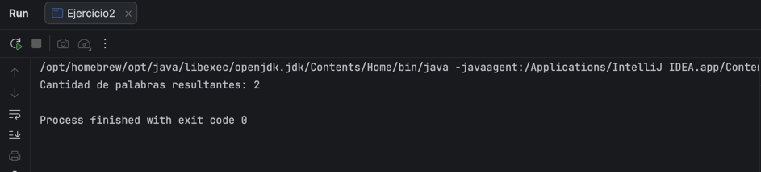

**Explicación:** Se usó `filter()` para quedarnos con las palabras de más de 4 caracteres, `map()` con method reference (`String::toUpperCase`) para pasarlas a mayúsculas, y `sorted()` para ordenarlas alfabéticamente antes de contar el resultado.

### Ejercicio 03 — Obtener nombres de los Usuarios

Dada una lista de usuarios con los atributos: id, name, age, active. Filtrar únicamente los usuarios activos, obtener una lista con los nombres en mayúscula y ordenada alfabéticamente.

**Código implementado:**
```java
package dosw.semana_1.streams;

import java.util.List;
import java.util.stream.Collectors;

public class Ejercicio3 {

    record User(int id, String name, int age, boolean active) {}

    public static void main(String[] args) {
        List<User> users = List.of(
                new User(1, "Daniel", 25, true),
                new User(2, "Ana", 27, false),
                new User(3, "Beatriz", 20, true),
                new User(4, "Diego", 32, false),
        );

        List<String> sortedUsers = users.stream()
                .filter(User::active)
                .map(User::name)
                .map(String::toUpperCase)
                .sorted()
                .collect(Collectors.toList());

        System.out.println(sortedUsers);
    }
}
```

**Captura de ejecución:** 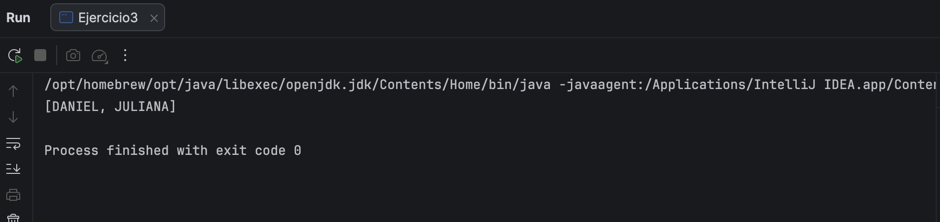

**Explicación:** Se usó `filter()` con method reference (`User::active`) para quedarnos solo con los usuarios activos, `map()` para extraer el nombre (`User::name`) y transformarlo a mayúsculas (`String::toUpperCase`), y `sorted()` para ordenar alfabéticamente el resultado.

### Ejercicio 04 — Personas mayores de edad

Dado un listado de Usuarios (mismos atributos anteriores), filtrar las personas mayores de edad y obtener sus nombres.

**Código implementado:**
```java
package dosw.semana_1.streams;

import java.util.List;
import java.util.stream.Collectors;

public class Ejercicio4 {

    record User(int id, String name, int age, boolean active) {}

    public static void main(String[] args) {
        List<User> users = List.of(
                new User(1, "Daniel", 25, true),
                new User(2, "Ana", 27, false),
                new User(3, "Juliana", 15, true),
                new User(4, "Diego", 32, false)
        );

        List<String> mayores = users.stream()
                .filter(u -> u.age() >= 18)
                .map(User::name)
                .collect(Collectors.toList());

        System.out.println(mayores);
    }
}
```

**Captura de ejecución:** 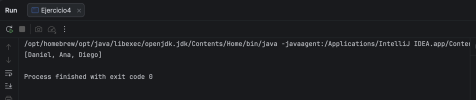

**Explicación:** Se usó `filter()` con una lambda para quedarnos únicamente con los usuarios de 18 años o más, y `map()` con method reference (`User::name`) para extraer solo sus nombres.

### Ejercicio 05 — Transacciones Bancarias

Dada una lista de transacciones bancarias (id, amount, approved), procesar la lista usando Streams para: ver cada transacción con `peek()`, verificar si existe al menos una no aprobada, y retornar si el lote es válido.

**Código implementado:**
```java
package dosw.semana_1.streams;

import java.util.List;

public class Ejercicio5 {

    record Transaction(String id, double amount, boolean approved) {}

    public static void main(String[] args) {
        List<Transaction> transactions = List.of(
                new Transaction("T1", 150.0, true),
                new Transaction("T2", 300.0, true),
                new Transaction("T3", 75.5, false),
                new Transaction("T4", 200.0, true)
        );

        boolean hayNoAprobadas = transactions.stream()
                .peek(System.out::println)
                .anyMatch(t -> !t.approved());

        boolean loteValido = !hayNoAprobadas;

        System.out.println("¿Lote válido? " + loteValido);
    }
}
```

**Captura de ejecución:** 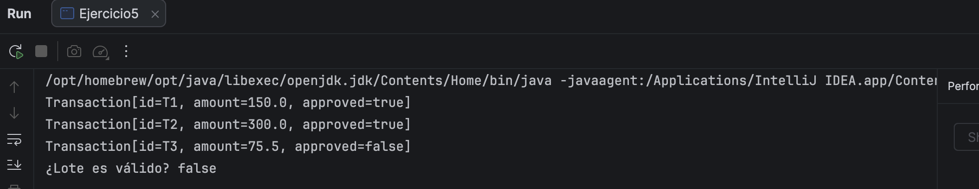

**Explicación:** Se usó `peek()` para imprimir cada transacción a medida que se procesa, y `anyMatch()` para verificar si existe al menos una no aprobada. Como `anyMatch()` hace corto circuito, deja de evaluar transacciones apenas encuentra una que cumple la condición (por eso T4 no se llegó a procesar). El lote se considera válido solo si no hay ninguna no aprobada.


# SEMANA No 2 — Bitácora Pokémon

## Datos de Entrenador: 
- Nombre y Apellido: Cristian Moreno
- Código de Estudiante: 1000100162
- Curso: DOSW 

### Ejercicio 01 — Pokémon Tipo Fuego

Dada una lista de Pokémon con nombre y tipo, obtener únicamente aquellos cuyo tipo sea Fuego.

**Código implementado:**
```java
package dosw.semana_2.pokemon;

import java.util.List;
import java.util.stream.Collectors;

public class Ejercicio1 {

    record Pokemon(String nombre, String tipo) {}

    public static void main(String[] args) {
        List<Pokemon> pokemones = List.of(
                new Pokemon("Pikachu", "Eléctrico"),
                new Pokemon("Charmander", "Fuego"),
                new Pokemon("Squirtle", "Agua"),
                new Pokemon("Vulpix", "Fuego"),
                new Pokemon("Bulbasaur", "Planta"),
                new Pokemon("Flareon", "Fuego")
        );

        List<String> tipoFuego = pokemones.stream()
                .filter(p -> p.tipo().equals("Fuego"))
                .map(Pokemon::nombre)
                .collect(Collectors.toList());

        System.out.println(tipoFuego);
    }
}
```

**Captura de ejecución:** 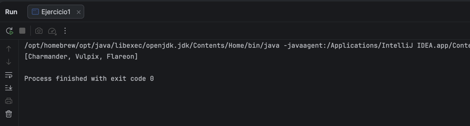

**Explicación:** Se usó `filter()` con una lambda para quedarnos solo con los Pokémon de tipo Fuego, y `map()` con method reference (`Pokemon::nombre`) para extraer únicamente sus nombres.

### Ejercicio 02 — Pokédex Gritona

Transformar todos los nombres de Pokémon a mayúsculas.

**Código implementado:**
```java
package dosw.semana_2.pokemon;

import java.util.List;
import java.util.stream.Collectors;

public class Ejercicio2 {

    public static void main(String[] args) {
        List<String> pokemones = List.of("Pikachu", "Charmander", "Squirtle", "Bulbasaur");

        List<String> pokedexGritona = pokemones.stream()
                .map(String::toUpperCase)
                .collect(Collectors.toList());

        System.out.println(pokedexGritona);
    }
}
```

**Captura de ejecución:** 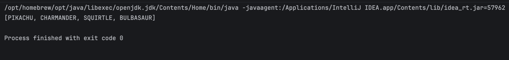

**Explicación:** Se usó `map()` con method reference (`String::toUpperCase`) para transformar cada nombre a mayúsculas de forma simple y directa.

### Ejercicio 03 — Poder Total del Equipo

Dada una lista de niveles de Pokémon, calcular la suma total de niveles del equipo.

**Código implementado:**
```java
package dosw.semana_2.pokemon;

import java.util.List;

public class Ejercicio3 {

    public static void main(String[] args) {
        List<Integer> niveles = List.of(45, 62, 38, 71, 55, 29);

        int sumaTotal = niveles.stream()
                .reduce(0, Integer::sum);

        System.out.println("Suma total de niveles: " + sumaTotal);
    }
}
```

**Captura de ejecución:** 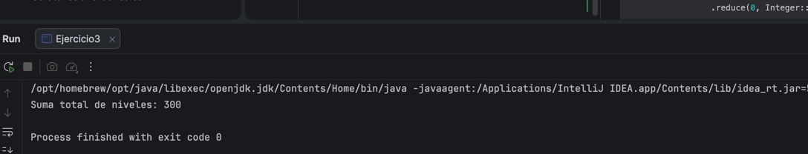

**Explicación:** Se usó `reduce()` con un valor inicial de 0 y `Integer::sum` como method reference para acumular la suma de todos los niveles del Stream.

### Ejercicio 04 — Pokémon Alfa

Encontrar el Pokémon con el nivel más alto dentro del equipo.

**Código implementado:**
```java
package dosw.semana_2.pokemon;

import java.util.Comparator;
import java.util.List;
import java.util.Optional;

public class Ejercicio4 {

    record Pokemon(String nombre, int nivel) {}

    public static void main(String[] args) {
        List<Pokemon> pokemones = List.of(
                new Pokemon("Pikachu", 45),
                new Pokemon("Charmander", 62),
                new Pokemon("Squirtle", 38),
                new Pokemon("Snorlax", 90),
                new Pokemon("Mewtwo", 88)
        );

        Optional<Pokemon> alfa = pokemones.stream()
                .max(Comparator.comparingInt(Pokemon::nivel));

        alfa.ifPresent(p -> System.out.println("Pokémon Alfa: " + p.nombre() + " (nivel " + p.nivel() + ")"));
    }
}
```

**Captura de ejecución:** 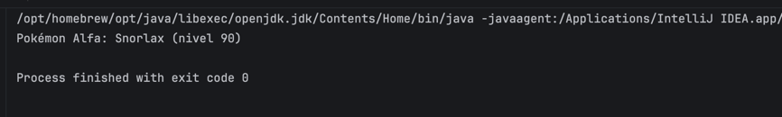

**Explicación:** Se usó `max()` con un `Comparator.comparingInt()` sobre el nivel de cada Pokémon para encontrar el de mayor nivel, devuelto como `Optional<Pokemon>`.

### Ejercicio 05 — Pokémon Legendarios

Contar cuántos Pokémon del equipo tienen nivel superior a 80.

**Código implementado:**
```java
package dosw.semana_2.pokemon;

import java.util.List;
import java.util.stream.Collectors;

public class Ejercicio5 {

    record Pokemon(String nombre, int nivel) {}

    public static void main(String[] args) {
        List<Pokemon> pokemones = List.of(
                new Pokemon("Pikachu", 45),
                new Pokemon("Mewtwo", 88),
                new Pokemon("Dragonite", 82),
                new Pokemon("Squirtle", 38),
                new Pokemon("Mew", 85),
                new Pokemon("Charmander", 62)
        );

        List<Pokemon> superiores80 = pokemones.stream()
                .filter(p -> p.nivel() > 80)
                .collect(Collectors.toList());

        String nombres = superiores80.stream()
                .map(Pokemon::nombre)
                .collect(Collectors.joining(", "));

        System.out.println("Pokémon con nivel > 80: " + superiores80.size() + " (" + nombres + ")");
    }
}
```

**Captura de ejecución:** 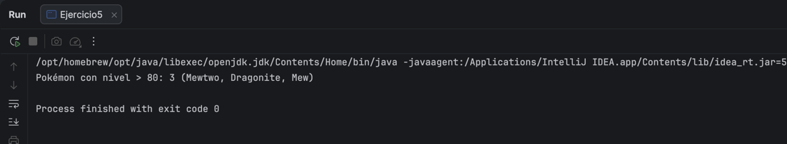

**Explicación:** Se usó `filter()` para quedarnos con los Pokémon de nivel superior a 80, `size()` para contarlos y `Collectors.joining()` para mostrar sus nombres separados por coma.

### Ejercicio 06 — Pokédex Sin Duplicados

Dada una lista de Pokémon con elementos repetidos, generar una nueva colección donde cada Pokémon aparezca una sola vez.

**Código implementado:**
```java
package dosw.semana_2.pokemon;

import java.util.List;
import java.util.stream.Collectors;

public class Ejercicio6 {

    public static void main(String[] args) {
        List<String> pokemones = List.of("Pikachu", "Charmander", "Pikachu", "Squirtle", "Charmander", "Mewtwo");

        List<String> sinDuplicados = pokemones.stream()
                .distinct()
                .collect(Collectors.toList());

        System.out.println(sinDuplicados);
    }
}
```

**Captura de ejecución:** 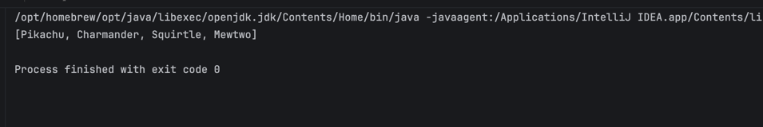

**Explicación:** Se usó `distinct()` para eliminar los elementos repetidos del Stream, conservando el orden de primera aparición.

### Ejercicio 07 — Orden del Profesor Oak

El Profesor Oak quiere su Pokédex organizada. Ordenar alfabéticamente los nombres de los Pokémon.

**Código implementado:**
```java
package dosw.semana_2.pokemon;

import java.util.List;
import java.util.stream.Collectors;

public class Ejercicio7 {

    public static void main(String[] args) {
        List<String> pokemones = List.of("Squirtle", "Pikachu", "Mewtwo", "Bulbasaur", "Charmander", "Abra");

        List<String> ordenados = pokemones.stream()
                .sorted()
                .collect(Collectors.toList());

        System.out.println(ordenados);
    }
}
```

**Captura de ejecución:** 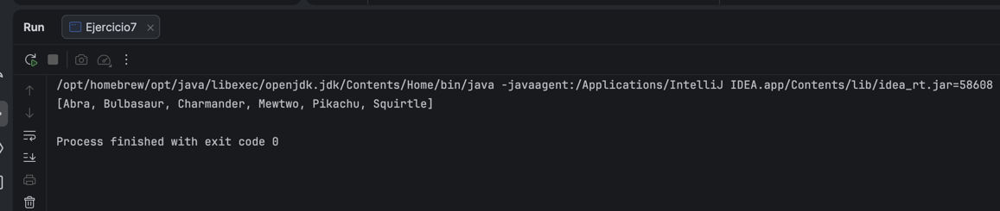

**Explicación:** Se usó `sorted()` sin comparador personalizado, aprovechando el orden natural alfabético de los `String`.

### Ejercicio 08 — Evoluciones Preparadas

Dada una lista de Pokémon que incluye si pueden evolucionar (boolean puedeEvolucionar), obtener únicamente los que estén listos para evolucionar.

**Código implementado:**
```java
package dosw.semana_2.pokemon;

import java.util.List;
import java.util.stream.Collectors;

public class Ejercicio8 {

    record Pokemon(String nombre, boolean puedeEvolucionar) {}

    public static void main(String[] args) {
        List<Pokemon> pokemones = List.of(
                new Pokemon("Pikachu", true),
                new Pokemon("Raichu", false),
                new Pokemon("Charmander", true),
                new Pokemon("Charizard", false),
                new Pokemon("Squirtle", true),
                new Pokemon("Blastoise", false)
        );

        List<String> listosParaEvolucionar = pokemones.stream()
                .filter(Pokemon::puedeEvolucionar)
                .map(Pokemon::nombre)
                .collect(Collectors.toList());

        System.out.println("Listos para evolucionar: " + listosParaEvolucionar);
    }
}
```

**Captura de ejecución:** 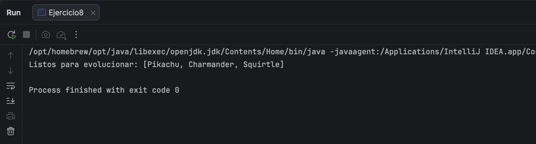

**Explicación:** Se usó `filter()` con method reference (`Pokemon::puedeEvolucionar`) para quedarnos solo con los Pokémon listos para evolucionar, y `map()` para extraer sus nombres.

### Ejercicio 09 — Equipo Élite

A partir del Nivel 3 se trabaja con la clase `Pokemon` (id, nombre, tipo, nivel, poderCombate, region, legendario). Mostrar únicamente los Pokémon cuyo poderCombate sea superior a 500.

**Clase Pokemon (reutilizada desde este ejercicio en adelante):**
```java
package dosw.semana_2.pokemon;

public class Pokemon {
    private Long id;
    private String nombre;
    private String tipo;
    private int nivel;
    private double poderCombate;
    private String region;
    private boolean legendario;

    public Pokemon(Long id, String nombre, String tipo, int nivel, double poderCombate, String region, boolean legendario) {
        this.id = id;
        this.nombre = nombre;
        this.tipo = tipo;
        this.nivel = nivel;
        this.poderCombate = poderCombate;
        this.region = region;
        this.legendario = legendario;
    }

    public Long getId() { return id; }
    public String getNombre() { return nombre; }
    public String getTipo() { return tipo; }
    public int getNivel() { return nivel; }
    public double getPoderCombate() { return poderCombate; }
    public String getRegion() { return region; }
    public boolean isLegendario() { return legendario; }
}
```

**Código implementado:**
```java
package dosw.semana_2.pokemon;

import java.util.List;
import java.util.stream.Collectors;

public class Ejercicio9 {

    public static void main(String[] args) {
        List<Pokemon> pokemones = List.of(
                new Pokemon(1L, "Pikachu", "Eléctrico", 45, 320, "Kanto", false),
                new Pokemon(2L, "Mewtwo", "Psíquico", 88, 680, "Kanto", true),
                new Pokemon(3L, "Dragonite", "Dragón", 82, 530, "Kanto", false),
                new Pokemon(4L, "Squirtle", "Agua", 38, 210, "Kanto", false),
                new Pokemon(5L, "Gengar", "Fantasma", 65, 495, "Kanto", false),
                new Pokemon(6L, "Charizard", "Fuego", 78, 610, "Kanto", false)
        );

        List<Pokemon> equipoElite = pokemones.stream()
                .filter(p -> p.getPoderCombate() > 500)
                .collect(Collectors.toList());

        String resultado = equipoElite.stream()
                .map(p -> p.getNombre() + "(" + (int) p.getPoderCombate() + ")")
                .collect(Collectors.joining(", "));

        System.out.println("Equipo Élite (PC > 500): [" + resultado + "]");
    }
}
```

**Captura de ejecución:** 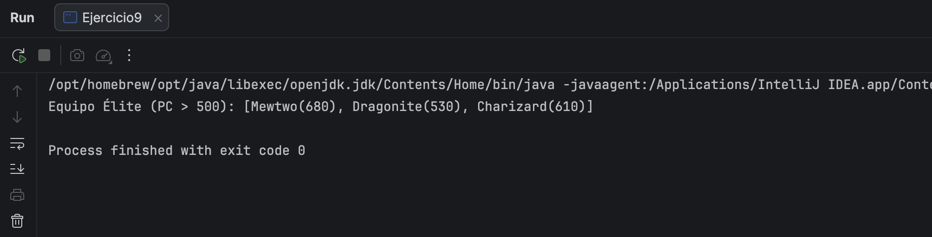

**Explicación:** Desde este ejercicio en adelante se trabaja con objetos complejos en vez de listas simples de tipos primitivos. Primero se creó la clase `Pokemon` con sus siete atributos y getters, siguiendo exactamente la especificación del taller. Luego, sobre la lista de instancias de `Pokemon`, se usó `filter()` con una lambda que evalúa `p.getPoderCombate() > 500` para quedarnos únicamente con los Pokémon cuyo poder de combate supera los 500 puntos. Como el resultado de ese filtro sigue siendo una lista de objetos `Pokemon` (y no de `String`), se hizo un segundo paso con `map()` para transformar cada objeto en una representación de texto legible (`nombre(poderCombate)`), y finalmente `Collectors.joining(", ")` para unir esos textos en un solo resultado separado por comas, replicando el formato de salida esperado por el taller. Esta separación en dos streams (uno para filtrar objetos, otro para darles formato de texto) es un patrón común cuando se necesita tanto la colección de objetos como una presentación distinta de esos datos.

### Ejercicio 10 — Pokédex Compacta

Generar una lista que contenga únicamente los nombres de todos los Pokémon del equipo.

**Código implementado:**
```java
package dosw.semana_2.pokemon;

import java.util.List;
import java.util.stream.Collectors;

public class Ejercicio10 {

    public static void main(String[] args) {
        List<Pokemon> pokemones = List.of(
                new Pokemon(1L, "Pikachu", "Eléctrico", 45, 320, "Kanto", false),
                new Pokemon(2L, "Mewtwo", "Psíquico", 88, 680, "Kanto", true),
                new Pokemon(3L, "Dragonite", "Dragón", 82, 530, "Kanto", false),
                new Pokemon(4L, "Squirtle", "Agua", 38, 210, "Kanto", false),
                new Pokemon(5L, "Gengar", "Fantasma", 65, 495, "Kanto", false),
                new Pokemon(6L, "Charizard", "Fuego", 78, 610, "Kanto", false)
        );

        List<String> nombres = pokemones.stream()
                .map(Pokemon::getNombre)
                .collect(Collectors.toList());

        System.out.println(nombres);
    }
}
```

**Captura de ejecución:** 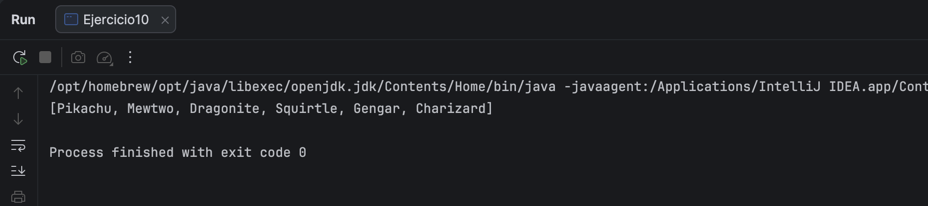

**Explicación:** Este ejercicio es un caso directo de transformación de tipo dentro de un Stream: se parte de una `List<Pokemon>` (objetos complejos con siete atributos cada uno) y se necesita llegar a una `List<String>` que contenga solo un dato puntual de cada objeto. Para eso se usa `map()`, cuya función es aplicar una transformación a cada elemento del Stream sin alterar la cantidad de elementos ni el orden original. Como transformación se usó el method reference `Pokemon::getNombre`, equivalente a escribir la lambda `p -> p.getNombre()`, pero más compacto y legible, ya que simplemente delega la llamada al getter correspondiente de cada objeto. El resultado de `map()` sigue siendo un Stream, por lo que se cierra con `collect(Collectors.toList())` para materializarlo de nuevo en una lista concreta que se pueda imprimir. Este patrón (`map()` + `getX()`) es la base de casi todas las "proyecciones" de datos que se piden más adelante en el taller, donde se necesita extraer un subconjunto de información de una colección de objetos más ricos.

### Ejercicio 11 — Poder Promedio

Calcular el promedio de poderCombate de todos los Pokémon del equipo.

**Código implementado:**
```java
package dosw.semana_2.pokemon;

import java.util.List;

public class Ejercicio11 {

    public static void main(String[] args) {
        List<Pokemon> pokemones = List.of(
                new Pokemon(1L, "Pikachu", "Eléctrico", 45, 320, "Kanto", false),
                new Pokemon(2L, "Mewtwo", "Psíquico", 88, 680, "Kanto", true),
                new Pokemon(3L, "Dragonite", "Dragón", 82, 530, "Kanto", false),
                new Pokemon(4L, "Squirtle", "Agua", 38, 210, "Kanto", false),
                new Pokemon(5L, "Gengar", "Fantasma", 65, 495, "Kanto", false),
                new Pokemon(6L, "Charizard", "Fuego", 78, 610, "Kanto", false)
        );

        double promedio = pokemones.stream()
                .mapToDouble(Pokemon::getPoderCombate)
                .average()
                .orElse(0);

        System.out.printf("Poder de combate promedio: %.2f%n", promedio);
    }
}
```

**Captura de ejecución:** 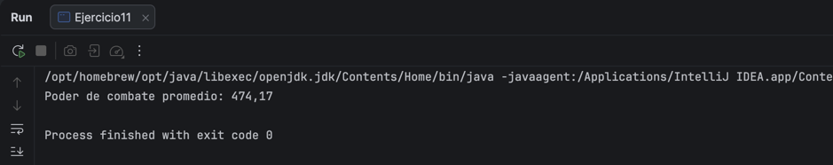

**Explicación:** Este ejercicio necesita un dato numérico agregado (un promedio), y para eso Java ofrece los Streams especializados en primitivos (`IntStream`, `LongStream`, `DoubleStream`), que traen operaciones estadísticas listas como `average()`, `sum()`, `min()` y `max()` sin necesidad de escribirlas manualmente con `reduce()`. Para llegar a ese Stream especializado se usó `mapToDouble()` en vez del `map()` normal: mientras `map()` transforma un Stream de objetos en otro Stream de objetos, `mapToDouble()` transforma un Stream de objetos (`Pokemon`) directamente en un `DoubleStream` de valores primitivos, extrayendo el `poderCombate` de cada uno mediante el method reference `Pokemon::getPoderCombate`. Sobre ese `DoubleStream` ya se puede llamar `average()`, que retorna un `OptionalDouble` (no un `double` directo) porque técnicamente el Stream podría estar vacío y no existiría promedio calculable; por eso se usa `.orElse(0)` como valor de respaldo. Finalmente, `System.out.printf` con el formato `%.2f` se usó para mostrar el resultado con exactamente dos decimales, tal como pide la salida esperada del taller (474.17 y no 474.166666...).

### Ejercicio 12 — Campeón Regional

Obtener el Pokémon con mayor poderCombate de toda la lista.

**Código implementado:**
```java
package dosw.semana_2.pokemon;

import java.util.Comparator;
import java.util.List;
import java.util.Optional;

public class Ejercicio12 {

    public static void main(String[] args) {
        List<Pokemon> pokemones = List.of(
                new Pokemon(1L, "Pikachu", "Eléctrico", 45, 320, "Kanto", false),
                new Pokemon(2L, "Mewtwo", "Psíquico", 88, 680, "Kanto", true),
                new Pokemon(3L, "Dragonite", "Dragón", 82, 530, "Kanto", false),
                new Pokemon(6L, "Charizard", "Fuego", 78, 610, "Kanto", false)
        );

        Optional<Pokemon> campeon = pokemones.stream()
                .max(Comparator.comparingDouble(Pokemon::getPoderCombate));

        campeon.ifPresent(p ->
                System.out.println("Campeón: " + p.getNombre() + " con PC: " + (int) p.getPoderCombate()));
    }
}
```

**Captura de ejecución:** 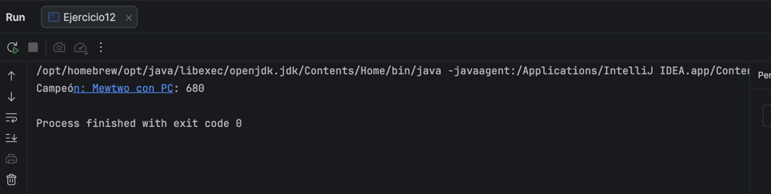

**Explicación:** Aunque este ejercicio es muy similar al #4 (Pokémon Alfa), aquí se comparó por `poderCombate` (un `double`) en vez de por `nivel` (un `int`), por eso se usó `Comparator.comparingDouble()` en lugar de `comparingInt()` — cada tipo primitivo tiene su variante especializada del comparador para evitar el costo de autoboxing (convertir el primitivo a su clase envolvente `Double`/`Integer`) que ocurriría si se usara `Comparator.comparing()` genérico. El method reference `Pokemon::getPoderCombate` le indica al comparador qué campo usar para decidir el "mayor" entre dos

### Ejercicio 13 — Organizar por Tipo

Agrupar todos los Pokémon por su tipo y mostrar el listado por grupo.

**Código implementado:**
```java
package dosw.semana_2.pokemon;

import java.util.List;
import java.util.Map;
import java.util.stream.Collectors;

public class Ejercicio13 {

    public static void main(String[] args) {
        List<Pokemon> pokemones = List.of(
                new Pokemon(1L, "Squirtle", "Agua", 38, 210, "Kanto", false),
                new Pokemon(2L, "Psyduck", "Agua", 25, 180, "Kanto", false),
                new Pokemon(3L, "Charmander", "Fuego", 25, 250, "Kanto", false),
                new Pokemon(4L, "Vulpix", "Fuego", 30, 260, "Kanto", false),
                new Pokemon(5L, "Bulbasaur", "Planta", 22, 220, "Kanto", false)
        );

        Map<String, List<String>> porTipo = pokemones.stream()
                .collect(Collectors.groupingBy(
                        Pokemon::getTipo,
                        Collectors.mapping(Pokemon::getNombre, Collectors.toList())
                ));

        porTipo.forEach((tipo, nombres) -> System.out.println(tipo + ": " + nombres));
    }
}
```

**Captura de ejecución:** 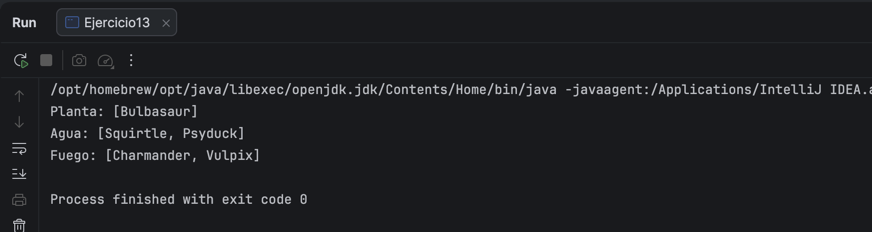


**Explicación:** Este ejercicio introduce `Collectors.groupingBy()`, el recolector encargado de dividir un Stream en subgrupos según una función clasificadora. Aquí la clasificación se hace por `Pokemon::getTipo`, así que el resultado final es un `Map<String, List<Pokemon>>` donde cada clave es un tipo (Agua, Fuego, Planta...) y cada valor la lista de Pokémon de ese tipo. Sin embargo, la salida esperada solo pide los *nombres*, no los objetos completos — por eso se usó la forma de dos argumentos de `groupingBy()`, donde el segundo argumento es un `Collector` "downstream" que se aplica dentro de cada grupo. En este caso se usó `Collectors.mapping(Pokemon::getNombre, Collectors.toList())`, que transforma cada elemento del grupo con `getNombre()` antes de coleccionarlo en una lista, evitando tener que hacer un segundo `map()` por separado después de agrupar. Finalmente se recorrió el `Map` resultante con `forEach()` para imprimir cada tipo junto a su lista de nombres.

### Ejercicio 14 — Organizar por Región

Agrupar los Pokémon según su región de origen.

**Código implementado:**
```java
package dosw.semana_2.pokemon;

import java.util.List;
import java.util.Map;
import java.util.stream.Collectors;

public class Ejercicio14 {

    public static void main(String[] args) {
        List<Pokemon> pokemones = List.of(
                new Pokemon(1L, "Pikachu", "Eléctrico", 45, 320, "Kanto", false),
                new Pokemon(2L, "Chikorita", "Planta", 20, 200, "Johto", false),
                new Pokemon(3L, "Torchic", "Fuego", 22, 210, "Hoenn", false),
                new Pokemon(4L, "Piplup", "Agua", 18, 190, "Sinnoh", false),
                new Pokemon(5L, "Charmander", "Fuego", 25, 250, "Kanto", false),
                new Pokemon(6L, "Totodile", "Agua", 21, 205, "Johto", false)
        );

        Map<String, List<String>> porRegion = pokemones.stream()
                .collect(Collectors.groupingBy(
                        Pokemon::getRegion,
                        Collectors.mapping(Pokemon::getNombre, Collectors.toList())
                ));

        porRegion.forEach((region, nombres) -> System.out.println(region + ": " + nombres));
    }
}
```

**Captura de ejecución:** 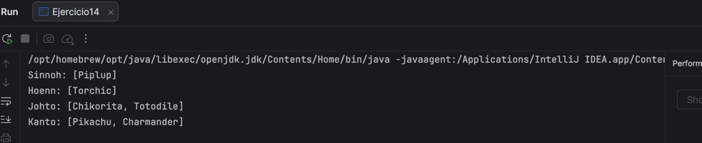

**Explicación:** Este ejercicio es estructuralmente idéntico al #13, solo que la agrupación se hace por región en vez de por tipo — lo cual demuestra la flexibilidad de `groupingBy()`: basta con cambiar la función clasificadora (`Pokemon::getRegion` en vez de `Pokemon::getTipo`) para reorganizar completamente los datos según otro criterio, sin tocar el resto de la lógica. Se mantuvo el mismo patrón de `groupingBy()` con `Collectors.mapping()` como downstream collector, para que cada grupo contenga directamente los nombres (`String`) en vez de los objetos `Pokemon` completos, que es lo que pide la salida esperada.

### Ejercicio 15 — Maestro de Gimnasios

A partir del Nivel 4 se trabaja también con la clase `Entrenador` (id, nombre, medallas, List<Pokemon>). Dado un listado de entrenadores con sus medallas, encontrar el entrenador con más medallas.

**Clase Entrenador (reutilizada desde este ejercicio en adelante):**
```java
package dosw.semana_2.pokemon;

import java.util.List;

public class Entrenador {
    private Long id;
    private String nombre;
    private int medallas;
    private List<Pokemon> equipo;

    public Entrenador(Long id, String nombre, int medallas, List<Pokemon> equipo) {
        this.id = id;
        this.nombre = nombre;
        this.medallas = medallas;
        this.equipo = equipo;
    }

    public Long getId() { return id; }
    public String getNombre() { return nombre; }
    public int getMedallas() { return medallas; }
    public List<Pokemon> getEquipo() { return equipo; }
}
```

**Código implementado:**
```java
package dosw.semana_2.pokemon;

import java.util.Comparator;
import java.util.List;
import java.util.Optional;

public class Ejercicio15 {

    public static void main(String[] args) {
        List<Entrenador> entrenadores = List.of(
                new Entrenador(1L, "Ash", 8, List.of()),
                new Entrenador(2L, "Misty", 5, List.of()),
                new Entrenador(3L, "Brock", 6, List.of()),
                new Entrenador(4L, "Gary", 10, List.of())
        );

        Optional<Entrenador> campeon = entrenadores.stream()
                .max(Comparator.comparingInt(Entrenador::getMedallas));

        campeon.ifPresent(e -> {
            System.out.println("Campeón de gimnasios: " + e.getNombre());
            System.out.println("Medallas obtenidas: " + e.getMedallas());
        });
    }
}
```

**Captura de ejecución:** 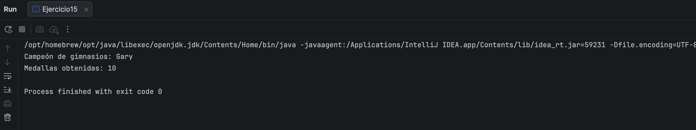

**Explicación:** Este ejercicio marca un cambio de nivel de abstracción: ya no se opera directamente sobre `Pokemon`, sino sobre `Entrenador`, una clase que a su vez *contiene* una lista de `Pokemon` (un objeto anidado dentro de otro). Para efectos de este ejercicio puntual esa lista interna no se usa todavía (se deja vacía con `List.of()`), pero la clase ya queda lista para los ejercicios siguientes del Nivel 4 que sí necesitan navegar dentro del equipo de cada entrenador. La lógica en sí reutiliza el mismo patrón que el Ejercicio 4 y el 12: `max()` con un `Comparator.comparingInt()`, esta vez usando `Entrenador::getMedallas` como criterio de comparación. El resultado, envuelto en `Optional<Entrenador>`, se procesa con `ifPresent()` y una lambda de bloque (con llaves `{}`) porque esta vez se necesitan imprimir dos líneas distintas en vez de una sola expresión.

### Ejercicio 16 — Entrenadores Experimentados

Mostrar únicamente los entrenadores que posean más de 5 medallas.

**Código implementado:**
```java
package dosw.semana_2.pokemon;

import java.util.List;
import java.util.stream.Collectors;

public class Ejercicio16 {

    public static void main(String[] args) {
        List<Entrenador> entrenadores = List.of(
                new Entrenador(1L, "Ash", 8, List.of()),
                new Entrenador(2L, "Misty", 5, List.of()),
                new Entrenador(3L, "Brock", 6, List.of()),
                new Entrenador(4L, "Gary", 10, List.of()),
                new Entrenador(5L, "May", 3, List.of()),
                new Entrenador(6L, "Dawn", 7, List.of())
        );

        List<Entrenador> experimentados = entrenadores.stream()
                .filter(e -> e.getMedallas() > 5)
                .collect(Collectors.toList());

        String resultado = experimentados.stream()
                .map(e -> e.getNombre() + "(" + e.getMedallas() + ")")
                .collect(Collectors.joining(", "));

        System.out.println("Entrenadores con > 5 medallas: [" + resultado + "]");
    }
}
```

**Captura de ejecución:** 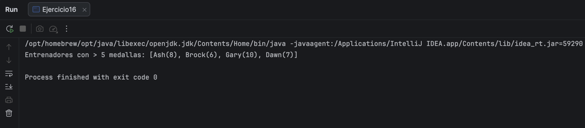

**Explicación:** Nótese que Misty, con exactamente 5 medallas, queda excluida del resultado — la condición del enunciado es "más de 5", es decir estrictamente mayor (`>`), no "5 o más" (`>=`). Es un detalle fácil de pasar por alto pero importante para que la salida coincida exactamente con la esperada. Al igual que en el Ejercicio 9, se usó `filter()` para obtener primero la lista de objetos `Entrenador` que cumplen la condición, y luego un segundo Stream con `map()` y `Collectors.joining()` únicamente para dar formato de texto al resultado impreso, manteniendo separada la lógica de filtrado de la lógica de presentación.

### Ejercicio 17 — Equipo Más Poderoso

Calcular cuál entrenador tiene la suma total de poderCombate más alta entre todos sus Pokémon.

**Código implementado:**
```java
package dosw.semana_2.pokemon;

import java.util.Comparator;
import java.util.List;
import java.util.Optional;

public class Ejercicio17 {

    private static double poderTotal(Entrenador e) {
        return e.getEquipo().stream()
                .mapToDouble(Pokemon::getPoderCombate)
                .sum();
    }

    public static void main(String[] args) {
        List<Entrenador> entrenadores = List.of(
                new Entrenador(1L, "Ash", 8, List.of(
                        new Pokemon(1L, "Pikachu", "Eléctrico", 45, 850, "Kanto", false),
                        new Pokemon(2L, "Charizard", "Fuego", 78, 1000, "Kanto", false))),
                new Entrenador(2L, "Gary", 10, List.of(
                        new Pokemon(3L, "Nidoking", "Veneno", 70, 1140, "Kanto", false),
                        new Pokemon(4L, "Arcanine", "Fuego", 65, 1200, "Kanto", false))),
                new Entrenador(3L, "Brock", 6, List.of(
                        new Pokemon(5L, "Onix", "Roca", 55, 900, "Kanto", false),
                        new Pokemon(6L, "Geodude", "Roca", 40, 770, "Kanto", false)))
        );

        Optional<Entrenador> masPoderoso = entrenadores.stream()
                .max(Comparator.comparingDouble(Ejercicio17::poderTotal));

        masPoderoso.ifPresent(e -> {
            System.out.println("Entrenador más poderoso: " + e.getNombre());
            System.out.println("Poder acumulado del equipo: " + (int) poderTotal(e));
        });
    }
}
```

**Captura de ejecución:** 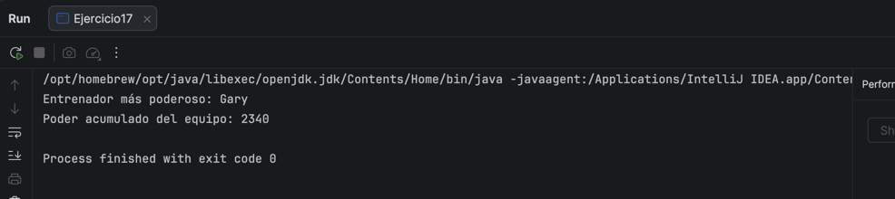

**Explicación:** Este ejercicio necesitaba comparar entrenadores por un valor que no es un atributo directo de la clase (como sí lo eran las medallas en el Ejercicio 15), sino un cálculo derivado: la suma de `poderCombate` de todos los Pokémon dentro de su equipo. Esto requiere un Stream anidado dentro de otro Stream, ya que por cada `Entrenador` hay que recorrer su lista interna de `Pokemon`. Para evitar calcular esa suma dos veces (una para comparar y otra para imprimir el resultado), se extrajo la lógica a un método auxiliar `poderTotal(Entrenador e)`, que internamente usa `mapToDouble()` sobre `e.getEquipo()` para convertir la lista de Pokémon en un `DoubleStream` de


### Ejercicio 18 — Top 5 Pokémon Más Fuertes

Generar un ranking de los cinco Pokémon con mayor poderCombate de toda la Pokédex.

**Código implementado:**
```java
package dosw.semana_2.pokemon;

import java.util.Comparator;
import java.util.List;
import java.util.stream.IntStream;

public class Ejercicio18 {

    public static void main(String[] args) {
        List<Pokemon> pokemones = List.of(
                new Pokemon(1L, "Pikachu", "Eléctrico", 45, 320, "Kanto", false),
                new Pokemon(2L, "Mewtwo", "Psíquico", 88, 680, "Kanto", true),
                new Pokemon(3L, "Dragonite", "Dragón", 82, 530, "Kanto", false),
                new Pokemon(4L, "Squirtle", "Agua", 38, 210, "Kanto", false),
                new Pokemon(5L, "Gengar", "Fantasma", 65, 495, "Kanto", false),
                new Pokemon(6L, "Charizard", "Fuego", 78, 610, "Kanto", false)
        );

        List<Pokemon> top5 = pokemones.stream()
                .sorted(Comparator.comparingDouble(Pokemon::getPoderCombate).reversed())
                .limit(5)
                .toList();

        IntStream.rangeClosed(1, top5.size())
                .mapToObj(i -> "#" + i + " " + top5.get(i - 1).getNombre() + " - PC: " + (int) top5.get(i - 1).getPoderCombate())
                .forEach(System.out::println);
    }
}
```

**Captura de ejecución:** 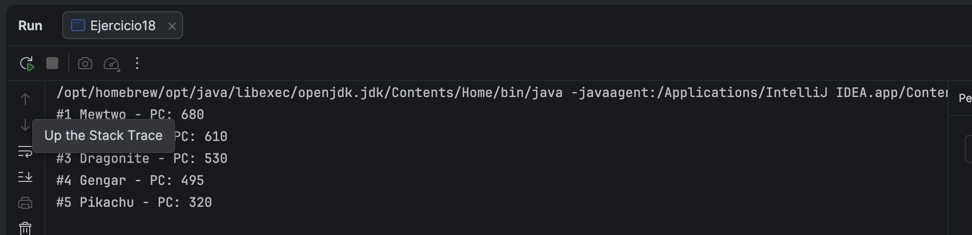

**Explicación:** Se usó `sorted()` con `Comparator.comparingDouble(Pokemon::getPoderCombate).reversed()` para ordenar de mayor a menor poder de combate, y `limit(5)` para quedarnos solo con los cinco primeros — tal como sugiere el hint del taller. El reto adicional era numerar el ranking (#1, #2...) sin usar un ciclo `for` tradicional ni una variable contador externa, ya que eso violaría la regla de "solo Streams y Lambdas". La solución fue usar `IntStream.rangeClosed(1, top5.size())`, que genera un Stream de números del 1 al 5 (los puestos del ranking), y con `mapToObj()` se transforma cada número de puesto en la línea de texto correspondiente, accediendo al Pokémon de esa posición con `top5.get(i - 1)` (restando 1 porque las listas empiezan en índice 0, pero el ranking empieza en 1). Finalmente `forEach(System.out::println)` imprime cada línea ya construida.

### Ejercicio 19 — Top 3 Entrenadores

Generar un ranking de los 3 mejores entrenadores considerando: 1° más medallas, 2° mayor poder acumulado, 3° orden alfabético como criterio de desempate.

**Código implementado:**
```java
package dosw.semana_2.pokemon;

import java.util.Comparator;
import java.util.List;
import java.util.stream.IntStream;

public class Ejercicio19 {

    private static double poderTotal(Entrenador e) {
        return e.getEquipo().stream()
                .mapToDouble(Pokemon::getPoderCombate)
                .sum();
    }

    public static void main(String[] args) {
        List<Entrenador> entrenadores = List.of(
                new Entrenador(1L, "Gary", 10, List.of(
                        new Pokemon(1L, "Nidoking", "Veneno", 70, 1140, "Kanto", false),
                        new Pokemon(2L, "Arcanine", "Fuego", 65, 1200, "Kanto", false))),
                new Entrenador(2L, "Ash", 8, List.of(
                        new Pokemon(3L, "Pikachu", "Eléctrico", 45, 850, "Kanto", false),
                        new Pokemon(4L, "Charizard", "Fuego", 78, 1000, "Kanto", false))),
                new Entrenador(3L, "Dawn", 7, List.of(
                        new Pokemon(5L, "Piplup", "Agua", 30, 1050, "Sinnoh", false),
                        new Pokemon(6L, "Buneary", "Normal", 28, 1050, "Sinnoh", false))),
                new Entrenador(4L, "Brock", 6, List.of(
                        new Pokemon(7L, "Onix", "Roca", 55, 900, "Kanto", false),
                        new Pokemon(8L, "Geodude", "Roca", 40, 770, "Kanto", false)))
        );

        Comparator<Entrenador> ranking = Comparator
                .comparingInt(Entrenador::getMedallas).reversed()
                .thenComparing(Comparator.comparingDouble(Ejercicio19::poderTotal).reversed())
                .thenComparing(Entrenador::getNombre);

        List<Entrenador> top3 = entrenadores.stream()
                .sorted(ranking)
                .limit(3)
                .toList();

        IntStream.range(0, top3.size())
                .mapToObj(i -> "#" + (i + 1) + " " + top3.get(i).getNombre()
                        + " - " + top3.get(i).getMedallas() + " medallas, PC: " + (int) poderTotal(top3.get(i)))
                .forEach(System.out::println);
    }
}
```

**Captura de ejecución:** 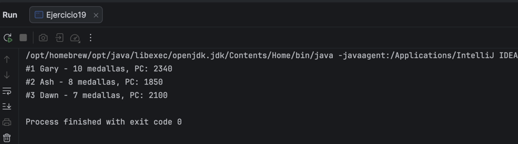

**Explicación:** Este ejercicio pide un ranking con **tres niveles de criterio de desempate**, el caso de uso exacto para `Comparator.thenComparing()`: encadena comparadores donde el segundo solo se aplica si el primero considera dos elementos "empatados", y el tercero solo si los dos anteriores empatan también. Se construyó así: `comparingInt(Entrenador::getMedallas).reversed()` (más medallas primero), `.thenComparing(comparingDouble(Ejercicio19::poderTotal).reversed())` (en empate de medallas, gana mayor poder acumulado del equipo, reutilizando el método auxiliar `poderTotal()` del Ejercicio 17), y

### Ejercicio 20 — Pokédex Analítica

Construir una estructura que muestre: cantidad de Pokémon por tipo, por región, cantidad de legendarios, promedio de nivel y el Pokémon más fuerte. Todo usando únicamente Streams.

**Código implementado:**
```java
package dosw.semana_2.pokemon;

import java.util.Comparator;
import java.util.List;
import java.util.Map;
import java.util.stream.Collectors;

public class Ejercicio20 {

    public static void main(String[] args) {
        List<Pokemon> pokemones = List.of(
                new Pokemon(1L, "Pikachu", "Eléctrico", 45, 320, "Kanto", false),
                new Pokemon(2L, "Mewtwo", "Psíquico", 88, 680, "Kanto", true),
                new Pokemon(3L, "Dragonite", "Dragón", 82, 530, "Johto", true),
                new Pokemon(4L, "Squirtle", "Agua", 38, 210, "Kanto", false),
                new Pokemon(5L, "Charmander", "Fuego", 62, 380, "Kanto", false),
                new Pokemon(6L, "Charizard", "Fuego", 78, 610, "Kanto", false)
        );

        Map<String, Long> porTipo = pokemones.stream()
                .collect(Collectors.groupingBy(Pokemon::getTipo, Collectors.counting()));

        Map<String, Long> porRegion = pokemones.stream()
                .collect(Collectors.groupingBy(Pokemon::getRegion, Collectors.counting()));

        long legendarios = pokemones.stream()
                .filter(Pokemon::isLegendario)
                .count();

        double promedioNivel = pokemones.stream()
                .mapToInt(Pokemon::getNivel)
                .average()
                .orElse(0);

        pokemones.stream()
                .max(Comparator.comparingDouble(Pokemon::getPoderCombate))
                .ifPresent(p -> {
                    System.out.println("Por tipo: " + porTipo);
                    System.out.println("Por región: " + porRegion);
                    System.out.println("Legendarios: " + legendarios);
                    System.out.printf("Promedio niv: %.1f%n", promedioNivel);
                    System.out.println("Más fuerte: " + p.getNombre() + " (PC: " + (int) p.getPoderCombate() + ")");
                });
    }
}
```

**Captura de ejecución:** 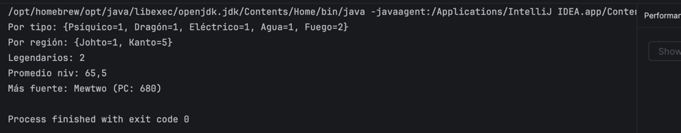

**Explicación:** Este ejercicio de cierre combina prácticamente todos los operadores vistos en el taller. Se usó `groupingBy()` con `Collectors.counting()` (en vez del `Collectors.mapping()` de los ejercicios 13 y 14) porque aquí solo interesa *cuántos* Pokémon hay por grupo, no sus nombres — `counting()` es un recolector downstream que simplemente cuenta los elementos de cada grupo en vez de coleccionarlos. Para los legendarios se usó `filter()` con method reference (`Pokemon::isLegendario`) seguido de `count()`, ya que es un total simple sin necesidad de agrupar. El promedio de nivel reutiliza el patrón de `mapToInt()` + `average()` visto en el Ejercicio 11. Finalmente, para el Pokémon más fuerte se usó `max()` con `Comparator.comparingDouble()`, igual que en ejercicios anteriores, y se aprovechó el `ifPresent()` de ese resultado para imprimir todo el reporte junto, evitando declarar variables sueltas fuera de los streams.

---

# TALLER DOSW #4 — Patrones de Diseño Combinados

## Datos personales:
- Nombre y Apellido Cristian Santiago Moreno
- Código de Estudiante: 1000100162
- Curso: DOSW

---

### Ejercicio 01 — Plataforma de Pagos Inteligentes

**Caso:** Una aplicación de e-commerce permite pagar con tarjeta, PSE, Nequi, PayPal y transferencia bancaria. Cada medio tiene una lógica distinta pero el flujo de compra es el mismo. Además, según el país del usuario, el sistema construye el proveedor de pago correcto.

**Patrones combinados:** Strategy + Factory Method

**Rol de cada patrón:**
- *Strategy* encapsula cada algoritmo de pago en una clase independiente (`TarjetaStrategy`, `PseStrategy`, `NequiStrategy`, `PaypalStrategy`, `StripeStrategy`), todas implementando la interfaz `PaymentStrategy`. Esto permite que `Checkout` use cualquier medio de pago sin conocer su implementación interna.
- *Factory Method* decide qué proveedor de pago construir según el país del usuario. `ColombiaPaymentFactory` solo sabe construir PSE, Nequi y Tarjeta; `UsaPaymentFactory` solo sabe construir PayPal, Stripe y Tarjeta.

**Cómo interactúan:** El cliente (`Checkout`) recibe una `PaymentFactory` según el país del usuario. Cuando se necesita procesar un pago, `Checkout` le pide a la Factory que construya la `PaymentStrategy` correspondiente al medio elegido, y luego simplemente llama `strategy.process(amount)` sin saber qué clase concreta se instanció. La Factory decide *qué* Strategy instanciar; el Checkout nunca cambia.

**Esquema de clases:**

PaymentStrategy (interfaz)

 * TarjetaStrategy 
 * PseStrategy 
 * NequiStrategy 
 * PaypalStrategy 
 * StripeStrategy

PaymentFactory (interfaz)
* ColombiaPaymentFactory, crea PSE / Nequi / Tarjeta
* UsaPaymentFactory, crea PayPal / Stripe / Tarjeta

Checkout
* usa PaymentFactory para obtener una PaymentStrategy y ejecutarla


**Código implementado:** ver `Ejercicio1.java`, `Checkout.java`, `PaymentStrategy.java`, `TarjetaStrategy.java`, `PseStrategy.java`, `NequiStrategy.java`, `PaypalStrategy.java`, `StripeStrategy.java`, `PaymentFactory.java`, `ColombiaPaymentFactory.java`, `UsaPaymentFactory.java` en `src/main/dosw/semana_4/patrones/`.

**Captura de ejecución:** 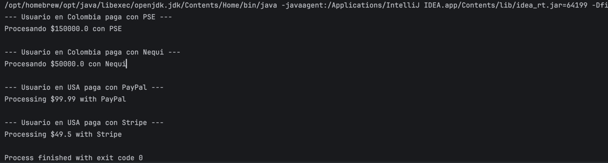

**Justificación:** Sin esta combinación, `Checkout` tendría que conocer directamente todas las clases concretas de pago y decidir con `if/else` o `switch` según el país cuál instanciar — mezclando la lógica de "qué país es" con la de "cómo se procesa cada pago". Separando estas dos responsabilidades con Strategy (el algoritmo de pago) y Factory Method (la construcción según contexto), se puede agregar un nuevo medio de pago o un nuevo país sin modificar `Checkout` en absoluto, cumpliendo el principio Open/Closed.

### Ejercicio 02 — Sistema de Notificaciones Multicanal

**Caso:** Cuando un pedido cambia de estado (pendiente → enviado → entregado), el sistema notifica por correo, SMS, WhatsApp y push. No todos los usuarios tienen activos los mismos canales. Cada canal tiene su propia forma de construir y formatear el mensaje.

**Patrones combinados:** Observer + Factory Method

**Rol de cada patrón:**
- *Observer* desacopla el `Pedido` (el Subject) de sus canales de notificación. `EmailNotifier`, `SmsNotifier` y `PushNotifier` son Observers que se suscriben al pedido. Agregar un canal nuevo no requiere modificar la clase `Pedido`.
- *Factory Method* crea el mensaje correcto para cada canal: `EmailMessageFactory` genera HTML, `SmsMessageFactory` genera texto plano (recortado a 160 caracteres), `PushMessageFactory` genera un payload JSON.

**Cómo interactúan:** Cuando `Pedido` cambia de estado, notifica a todos sus Observers activos llamando a `notify(event)`. Cada Observer, al recibir el evento, usa su propia `MessageFactory` internamente para construir el mensaje con el formato adecuado a su canal, y luego lo envía. El `Pedido` nunca sabe cómo se construye o envía cada mensaje — solo avisa que algo cambió.

**Esquema de clases:**

NotificationObserver (interfaz)
* EmailNotifier usa EmailMessageFactory 
* SmsNotifier usa SmsMessageFactory 
* PushNotifier  usa PushMessageFactory

MessageFactory (interfaz)
* EmailMessageFactory construye Message en HTML 
* SmsMessageFactory  construye Message en texto plano (máx 160 chars)
* PushMessageFactory construye Message en JSON

Pedido (Subject)
* mantiene lista de NotificationObserver y los notifica al cambiar de estado


**Código implementado:** ver `Ejercicio2.java`, `Pedido.java`, `OrderEvent.java`, `Message.java`, `NotificationObserver.java`, `EmailNotifier.java`, `SmsNotifier.java`, `PushNotifier.java`, `MessageFactory.java`, `EmailMessageFactory.java`, `SmsMessageFactory.java`, `PushMessageFactory.java` en `src/main/dosw/semana_4/patrones/ejercicio2/`.

**Captura de ejecución:** 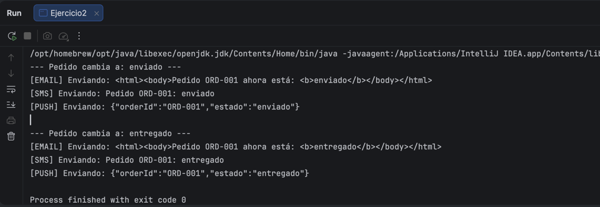

**Justificación:** Sin Observer, el `Pedido` tendría que conocer explícitamente cada canal y llamarlos uno por uno con lógica condicional según qué canales tiene activo el usuario — un cambio de acoplamiento fuerte. Sin Factory Method, cada Notifier tendría que construir su propio mensaje con lógica de formateo dispersa y duplicada dentro de sí mismo. Separando ambas responsabilidades, agregar un nuevo canal (por ejemplo WhatsApp) solo implica crear un `WhatsappNotifier` + `WhatsappMessageFactory` y suscribirlo al pedido — sin tocar ninguna clase existente.

### Ejercicio 03 — Sistema de Reportes Empresariales

**Caso:** La empresa genera reportes en PDF, Excel y CSV. Todos siguen los mismos 4 pasos: obtener datos → procesar información → aplicar formato → exportar archivo. Pero cada formato implementa "aplicar formato" y "exportar" de forma diferente. Además, el sistema decide dinámicamente qué tipo de reporte crear.

**Patrones combinados:** Template Method + Factory Method

**Rol de cada patrón:**
- Template Method define en `ReportGenerator` el método final `generate()`, que ejecuta siempre en el mismo orden los 4 pasos: `fetchData()`, `processData()` (comunes a todos los reportes, implementados en la clase base) y `applyFormat()`, `exportFile()` (abstractos, cada subclase decide cómo hacerlos).
- Factory Method (`ReportFactory`) crea la instancia correcta según el tipo de reporte solicitado (`"PDF"`, `"EXCEL"`, `"CSV"`), sin que el cliente tenga que instanciar `PdfReport`, `ExcelReport` o `CsvReport` directamente.

**Cómo interactúan:** El cliente pide un tipo de reporte a `ReportFactory`, que construye la subclase de `ReportGenerator` correspondiente. El cliente llama `generate()` sobre ese objeto, y el Template Method ejecuta los 4 pasos en orden: obtiene datos crudos, los procesa (transformándolos a mayúsculas, lógica compartida por todos), y delega los dos últimos pasos a la implementación específica de cada subclase, que toma esos mismos datos procesados y los formatea de manera distinta (HTML para PDF, separado por comas para CSV, separado por `|` para Excel) antes de "exportarlos".

**Esquema de clases:**

ReportGenerator (clase abstracta)
* generate() → método final (Template Method): fetchData → processData → applyFormat → exportFile 
* fetchData() / processData() → implementados en la base, compartidos 
* applyFormat() / exportFile() → abstractos 
* PdfReport → formatea en HTML 
* ExcelReport → formatea separado por "|"
* CsvReport → formatea separado por ","

ReportFactory
* create(tipo) → PdfReport | ExcelReport | CsvReport


**Código implementado:** ver `Ejercicio3.java`, `ReportGenerator.java`, `PdfReport.java`, `ExcelReport.java`, `CsvReport.java`, `ReportFactory.java` en `src/main/dosw/semana_4/patrones/ejercicio3/`.

**Ejecuttar clase ejercicio:**

**Captura de ejecución:** 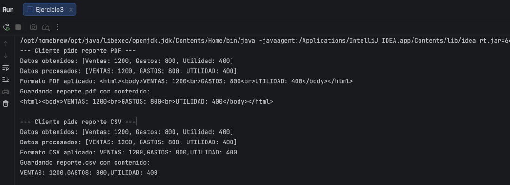

**Justificación:** Sin Template Method, cada tipo de reporte tendría que reimplementar el flujo completo de 4 pasos, duplicando la lógica de obtención y procesamiento de datos (que es idéntica en los tres formatos) y arriesgando que alguien cambie el orden de los pasos por error. Sin Factory Method, el cliente necesitaría un `if/else` o `switch` para decidir qué clase concreta instanciar cada vez que pide un reporte. Combinados, el esqueleto del algoritmo queda protegido (es `final`, no se puede sobreescribir el orden), solo varían los pasos que realmente cambian entre formatos, y agregar un nuevo tipo de reporte (por ejemplo JSON) solo requiere una nueva subclase y un caso más en la Factory — sin tocar el resto del sistema.

### Ejercicio 04 — Plataforma de Videojuegos — Personajes

**Caso:** Un videojuego crea guerreros, magos y arqueros. Cada personaje puede tener habilidades especiales, armadura, arma y mejoras temporales (escudo de hielo, velocidad extra, invisibilidad). El personaje se construye al inicio de la partida, pero sus poderes pueden aumentar dinámicamente durante el juego.

**Patrones combinados:** Builder + Decorator

**Rol de cada patrón:**
- *Builder* (`WarriorBuilder`) construye el personaje paso a paso al inicio de la partida (`setArmor()`, `setWeapon()`, `setSkill()`, `build()`), evitando un constructor con muchos parámetros. `CharacterDirector` permite construir arquetipos predefinidos como "guerrero élite".
- *Decorator* (`ShieldDecorator`, `SpeedDecorator`, `InvisibilityDecorator`) agrega poderes temporales dinámicamente durante la partida, envolviendo el personaje sin modificar su clase base.

**Cómo interactúan:** `WarriorBuilder` crea el personaje base configurable (`BaseCharacter`, implementando la interfaz `Character`). Durante la partida, cada poder temporal se aplica envolviendo el personaje con un Decorator (`new ShieldDecorator(new SpeedDecorator(guerrero))`). Cada Decorator, al ejecutar `attack()`, primero delega la llamada al objeto que envuelve y luego suma su propio bono de poder al resultado — así los efectos se acumulan sin que el personaje base sepa que están activos.

**Esquema de clases:**

Character (interfaz) → getNombre(), attack()
 * BaseCharacter → personaje base construido por el Builder 
 * CharacterDecorator (abstracta, envuelve un Character)
 * ShieldDecorator → +5 al poder de ataque 
 * SpeedDecorator → +3 al poder de ataque 
 * InvisibilityDecorator → +7 al poder de ataque

* WarriorBuilder → setArmor / setWeapon / setSkill / build()
* CharacterDirector → arquetipos predefinidos (guerreroElite)


**Código implementado:** ver `Ejercicio4.java`, `Character.java`, `BaseCharacter.java`, `WarriorBuilder.java`, `CharacterDirector.java`, `CharacterDecorator.java`, `ShieldDecorator.java`, `SpeedDecorator.java`, `InvisibilityDecorator.java` en `src/main/dosw/semana_4/patrones/ejercicio4/`.

**Ejecuttar clase ejercicio:**

**Captura de ejecución:** 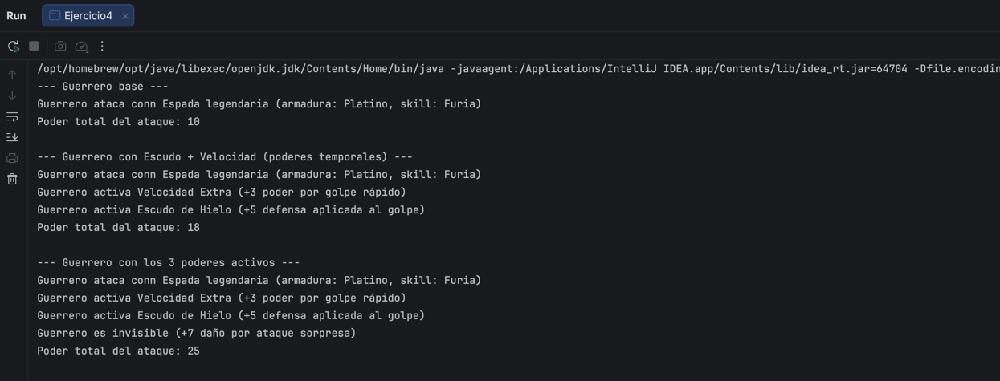

**Justificación:** Sin Decorator, cada combinación de poderes activos requeriría una subclase distinta — con 5 poderes posibles combinables, eso significa hasta 2⁵ = 32 subclases para cubrir todas las combinaciones. Con Decorator, solo se necesitan 5 wrappers + 1 clase base = 6 clases en total, y se pueden apilar en cualquier orden y cantidad en tiempo de ejecución. Sin Builder, construir un personaje con varios atributos configurables requeriría un constructor con muchos parámetros posicionales (propenso a errores) en vez de una API fluida y legible. Juntos, Builder resuelve "cómo se arma el personaje al inicio" y Decorator resuelve "cómo se potencia durante el juego" — son momentos distintos del ciclo de vida del personaje, y por eso no compiten entre sí.

### Ejercicio 05 — Integración con Sistema Bancario Antiguo

**Caso:** El sistema moderno usa `PaymentProcessor` con métodos modernos. El banco antiguo expone `LegacyBankService` con métodos incompatibles (`executeTransaction`, `verifyBalance` en centavos). Además, usar `LegacyBankService` directamente requiere 8 pasos de inicialización que los desarrolladores no deberían conocer.

**Patrones combinados:** Adapter + Facade

**Rol de cada patrón:**
- Adapterr (`LegacyBankAdapter`) hace que `LegacyBankService` sea compatible con la interfaz moderna `PaymentProcessor`. Internamente traduce las llamadas: `amount` (pesos, double) → `cents` (centavos, int), y `pay()` → `verifyBalance()` + `executeTransaction()`.
- Facade (`BankFacade`) expone un único método simple `procesarPago(monto)` que internamente orquesta los 8 pasos de inicialización y uso del banco legacy (o del Adapter). Los desarrolladores solo usan la Facade y nunca conocen los detalles internos.

**Cómo interactúan:** El desarrollador llama `BankFacade.procesarPago(monto)` → la Facade inicializa la conexión y autentica con el banco legacy, prepara el contexto de sesión y valida parámetros → delega al `LegacyBankAdapter`, que traduce el monto al formato legacy (centavos) → `LegacyBankService` verifica saldo y ejecuta la transacción → la Facade registra el comprobante, notifica y cierra la conexión. El desarrollador nunca toca `LegacyBankService` directamente.

**Esquema de clases:**

PaymentProcessor (interfaz moderna) → pay(amount)
* LegacyBankAdapter implements PaymentProcessor 
* traduce hacia LegacyBankService (executeTransaction, verifyBalance en centavos)

BankFacade 
* procesarPago(monto) → orquesta: conexión, autenticación, contexto, validación, 
* adapter.pay(monto), comprobante, notificación, cierre


**Código implementado:** ver `Ejercicio5.java`, `PaymentProcessor.java`, `LegacyBankService.java`, `LegacyBankAdapter.java`, `BankFacade.java` en `src/main/dosw/semana_4/patrones/ejercicio5/`.

**Ejecuttar clase ejercicio:**

**Captura de ejecución:** 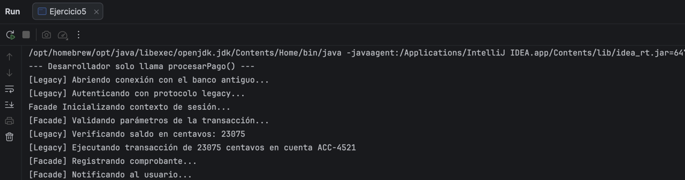


**Justificación:** Sin Adapter, el código moderno tendría que conocer directamente los métodos incompatibles del banco legacy (`executeTransaction`, saldos en centavos), acoplando toda la aplicación a los detalles de un sistema que además puede cambiar o ser reemplazado en el futuro. Sin Facade, cada desarrollador que necesite procesar un pago tendría que repetir manualmente los 8 pasos de inicialización, autenticación y cierre de conexión, con alto riesgo de olvidar alguno o hacerlo en el orden incorrecto. Ambos patrones son complementarios, no excluyentes: Adapter resuelve "hablar el idioma del otro sistema", y Facade resuelve "no me cuentes todo, dame lo simple" — la Facade internamente usa el Adapter, cada uno en su propia capa de responsabilidad.